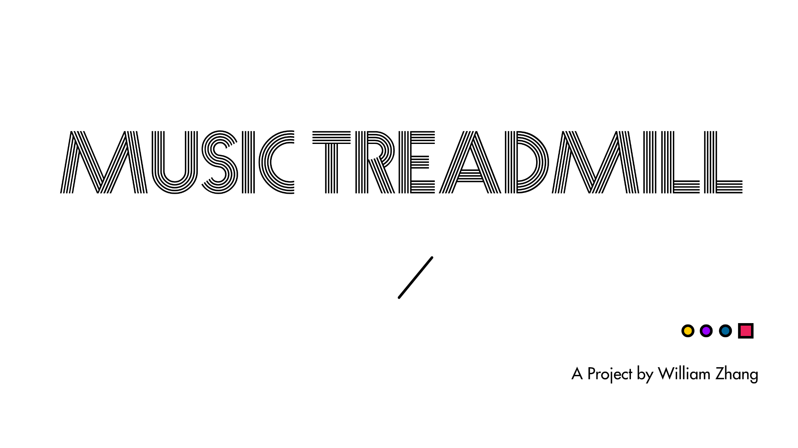
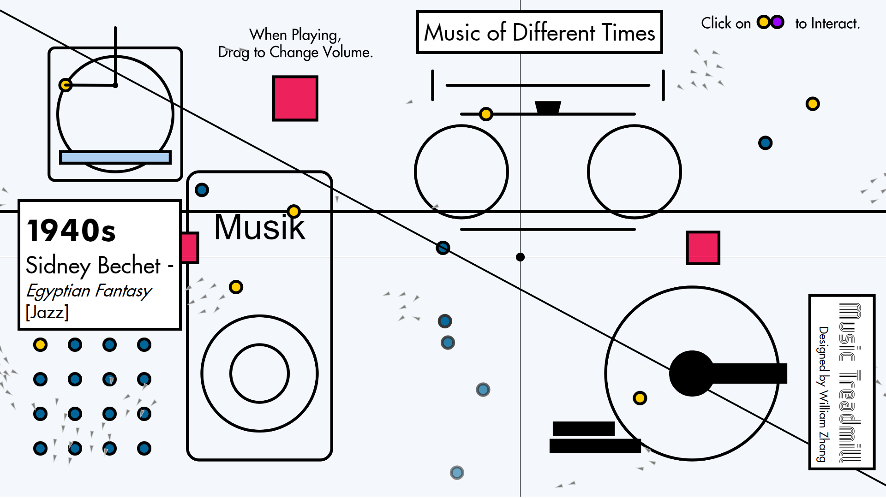

# Music Treadmill

## Fall 2019 Communications Lab Final Project  

A p5.js interactive project on history of music. 

### Project Link: https://mstxy.github.io/Music-Treadmill/

My Project – **Music Treadmill** actually follows the name Cosmic Treadmill, a thing used by the Flash to travel through time, which its function is similar to my idea – explore music of different times. Originally, I just wanted to use p5 to create a scene of various elements moving, interacting that give viewers a huge visual impact. Then I decided to embed some more ideas into it, so I chose the development of music to incorporate into the scene. In my project, the view will go through the Music Treadmill to explore the music of different times, different genre and in the end the viewer will have a chance to play all the music together and imagine what the future music will be like with an audio visualizer appearing on the scene.

  

So, I used p5 to create a lot of geometric shapes, and use a lot of variables and mathematical functions to create animations. I also involve I a lot of interactions –

1. Viewer could click on all yellow dots to play music;
2. All the moving objects on the scene could move/generate at different speed according to the beat of music;
3. With mouse drag you could create small particles that moves randomly on the screen;
4. There are two blocks that moves according to the mouse position;
5. There is a block that could be dragged to change the volume of the music;
6. There is words on the scene showing “music” in different languages that changes over time;
7. One rectangle on the top-left could change its height according to one specific music’s amplitude;
8. The audio visualizer in the end could response to mouse position and the music bass, alto and treble.

  

P5.js library is really powerful and its fft and amp analyzer allows me to create animations based on audio feedback. Since I mainly use p5.js as my development tool, the only things I need to work on are –

1. Since p5.js doesn’t have clicking function, I have to use mouse distance and mousePressed function to create such function;
2. Figure out ways to create various geometric shapes and route for interactive dots to follow;
3. Figure out different ways to place my 7 interactive dots;
4. Determine which part of my code need to loop and put them in draw(). Since draw() is default function, so I need to figure out ways to let other code which doesn’t need looping to be drawn;
5. Find suitable music to fit my project idea;
6. Find creative fonts;
7. Create variables for every moving object so that I could change them when music is playing;
8. Since p5.sound only works when the whole code is put on a server, I have to upload it to the imanas server every time I updated the code, which is quite a stressful thing when I need to debug the code by making small changes and add console.log at different places at different time.
9. Find out a way to make the music more enjoyable, more creative when viewer plays all the music together in the last part.

  

In all, I am still quite satisfied with my work. However, there are still some places need improvement on the code and if user is not well-informed, some bug and unpleasant experience could appear. But depending on the time limitation, I am quite glad that I could accomplish my initial thoughts and add more elements into it.

  

(Interaction Feedback: according to the users feedback on my project, I find that the user interaction is still some part unclear, so I will probably add a small box to introduce all the interaction elements in my project;

Also, I have a very nice conversation with a student on Leon’s class, his project is similar in the ideas of music, due to his DJ experience, he is able to create a webiste something like a remix pad; if possible, I’d like to add it to my project.)
